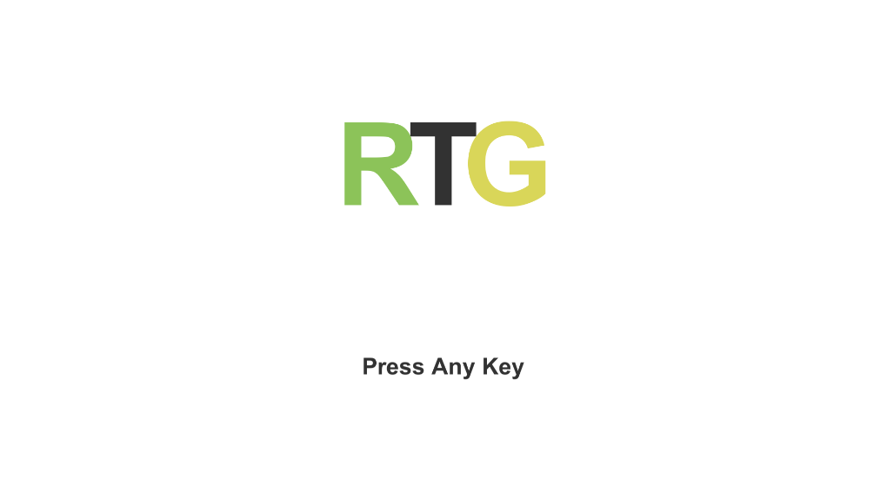
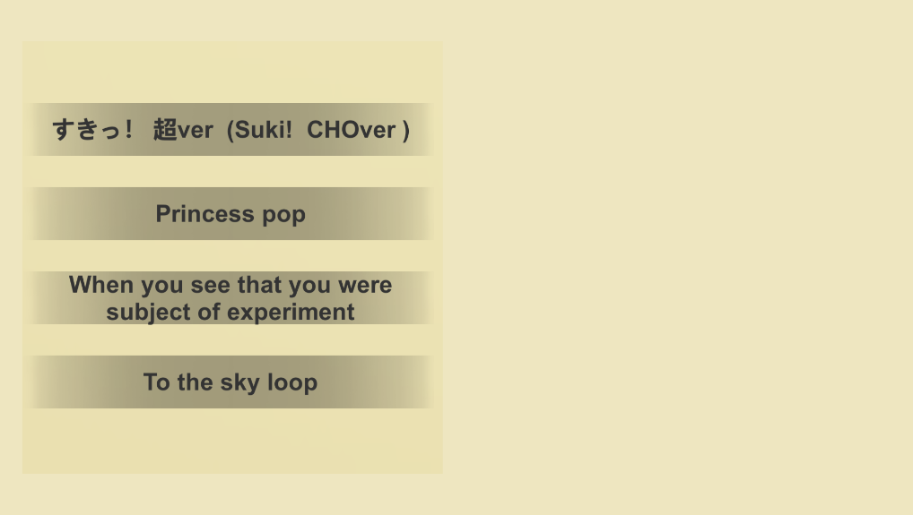
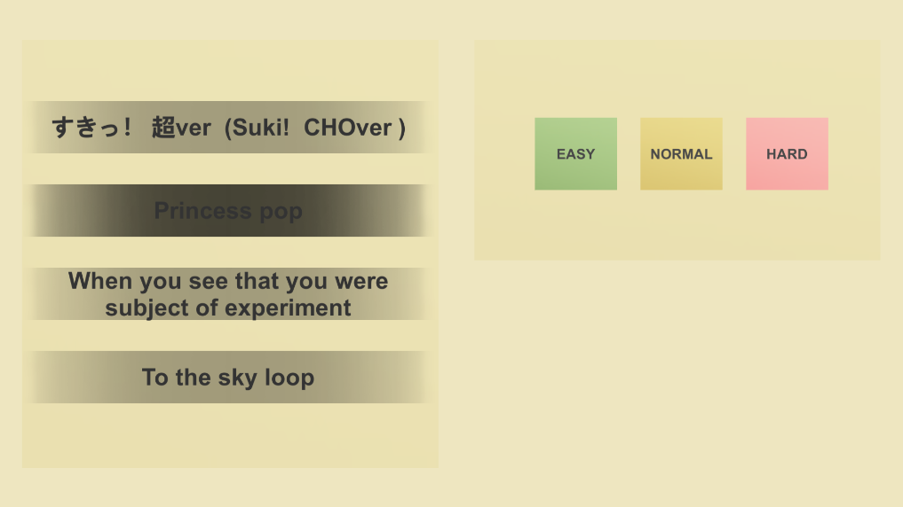
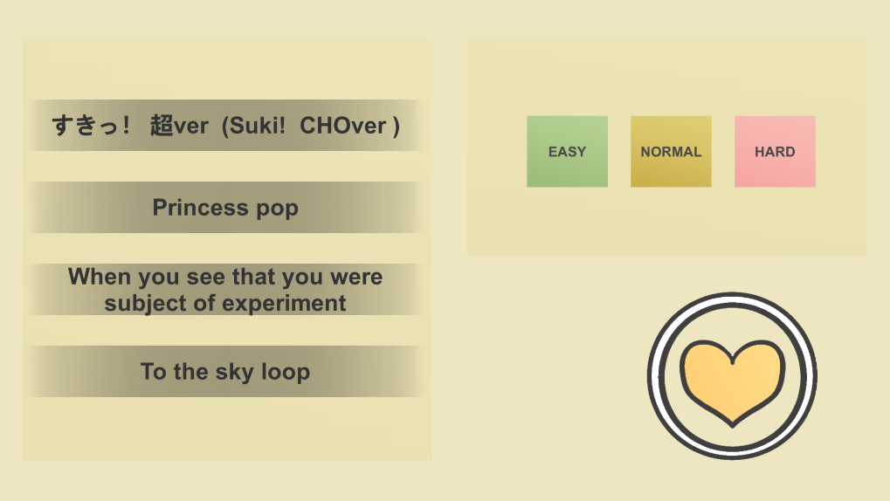
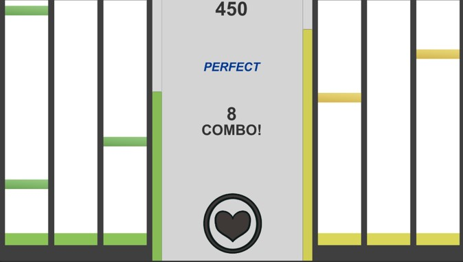
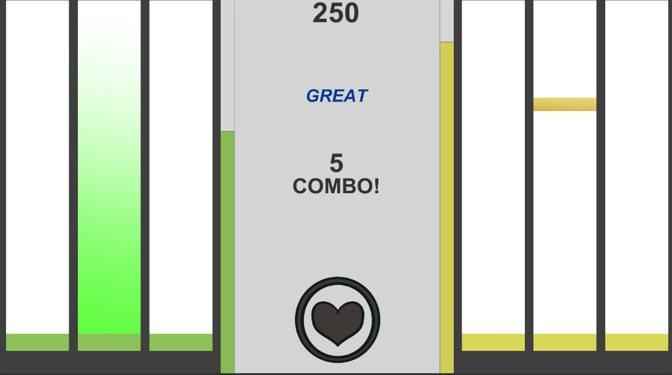
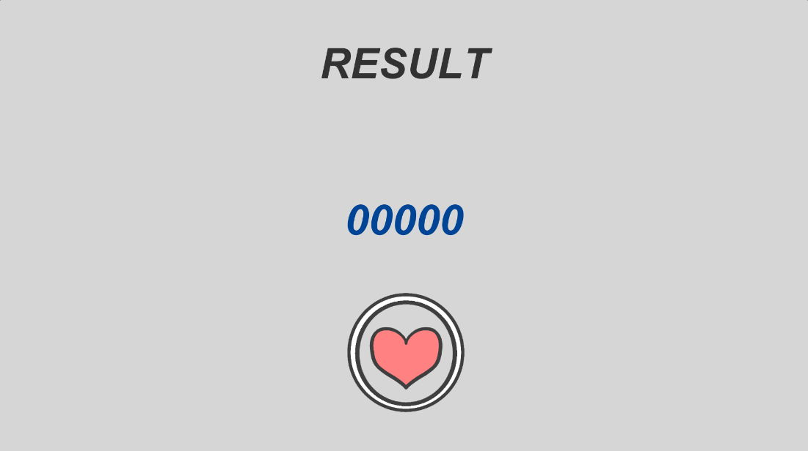

# [<b>목차</b>]  

[1. 게임명: RTG]()  
[2. 관련 이미지 & 동영상](#관련-이미지--동영상)  
[3. 대표 이미지](#대표-이미지)  
[4. 컨셉 & 대표이미지 기반 작품묘사](#컨셉--대표이미지-기반-작품묘사)  
[5. 구성 요소](#Regina-구성-요소)  
[6. 게임 시스템 디자인](#게임-시스템-디자인)  
* [a. 게임 오브젝트 분리](#게임-오브젝트-분리)
* [b. 파라미터(속성)](#파라미터-뽑아보기)
* [c. 플레이어 캐릭터 속성(파라미터)](#플레이어-캐릭터-속성파라미터)
* [d. 게임의 규칙](#게임의-규칙)

# [관련 이미지 & 동영상]

* 이미지

[(https://youtu.be/)](https://youtu.be/)

* 동영상

  
# [인게임 이미지]

* 게임 시작 화면

- 게임 제목이 화면에 표시된다.
- 아무 키나 입력해서 음악 선택 화면으로 진행할 수 있다.
  

* 곡 선택 화면

[곡 선택] 
- 플레이할 수 있는 곡 목록이 화면에 표시된다.
- 클릭으로 곡을 선택할 수 있다.   

[난이도 선택] 
-곡 선택 시 난이도를 선택할 수 있는 UI가 활성화 된다.  

[게임 시작] 
곡과 난이도를 선택하면 게임 시작 버튼이 활성화 된다.  

 
 

* 게임 플레이 화면

- 음악에 맞춰 노트가 내려온다.  
- 플레이어가 획득한 점수가 상단에 표시된다.  
- 노트 판정이 점수 하단에 표시된다.  
- 플레이어가 연속으로 판정에 성공한 횟수(콤보)가 화면 중앙에 표시된다.  
 

키 입력 시 라인이 빛나고 판정 성공 시 콤보 수가 올라간다.  
  

* 결과 화면

- 최종 결과 점수가 화면에 표시된다.  
- 하단의 돌아가기 버튼 클릭 시 곡 선택 화면으로 돌아갈 수 있다.

  

# [구성 요소]

## [메커니즘]

노트가 판정선에 닿을 때 키 입력 시 판정 성공

판정 성공 시 점수 획득

연속으로 판정 성공 시 콤보 up

 

판정 실패 시 체력 감소

콤보 초기화

체력이 0이 되면 게임 오버

체력 회복 노트로 회복 가능

 

## [디자인]

## [음향]

- 곡 목록 클릭 시 해당 곡이 재생된다.

# [게임 시스템 디자인]

## [게임 오브젝트 분리]

|연번|오브젝트 이름|오브젝트 이미지|  
|-----:|:-----:|-----|  
|1|일반 노트(왼쪽)||  
|2|일반 노트(오른쪽)||  
|3|회복 노트||  
|4|체력||  
|5|피버 게이지||  

## [플레이어 캐릭터 속성(파라미터)]  

|속성|영문명칭|설명|비고|
|:----:|:-------:|:----:|----|
|체력|Life|현재 체력 수치
|피버 게이지|fever|피버를 발동하기 위해 필요한 게이지||
|콤보|combo|노트 판정을 연속으로 성공한 횟수 ||
|점수|score|획득한 점수
 

## [노트 판정 알고리즘]

## [게임의 규칙]

### 1) 핵심 규칙

* 노트가 판정선에 도달했을 때 키 입력
* 정확도에 따라 판정이 달라지며(Perfect, Great, Miss) 획득 점수도 달라짐
* Miss 판정 시 체력이 감소
* 체력이 0이 되면 게임 오버

### 2) 보조 규칙

* 노트 판정으로 피버 게이지 획득
* 피버 모드 발동 시 획득 점수 두배 
